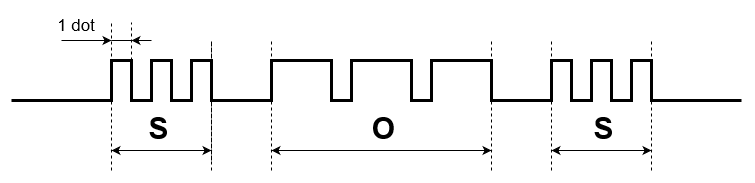
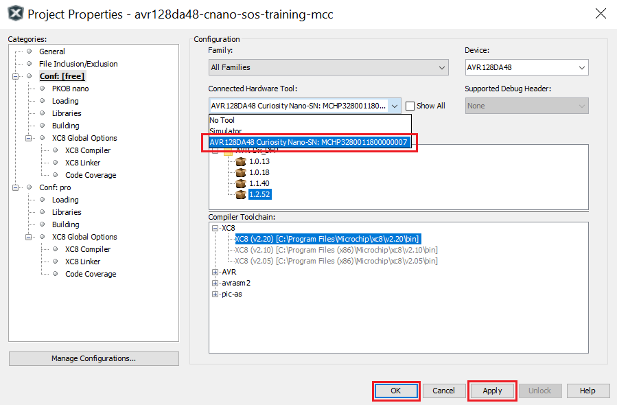
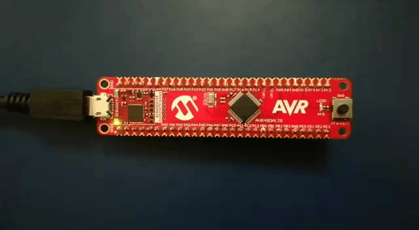
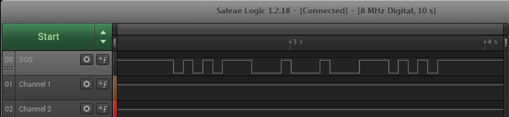

 <article class="markdown-body entry-content p-3 p-md-6" itemprop="This needs to locked down and 'never' changed">

 # AVR128DA48 SOS Sequence Generator

  This repository provides a MPLAB X project with a MCC generated code example for a SOS Sequence Generator.
   The application consists of a circuit composed of Core Independent Peripherals (CIPs), which operates with involvement of the core only in the initialization part.
  The CIPs used are: one instance of Timer/Counter Type D (TCD0), two instances of Timer/Counter Type A (TCA0 and TCA1), four Look-Up Tables (LUT0, LUT1, LUT2 and LUT3) and the Event System (EVSYS).
   The SOS message is represented by a specific waveform which drives the on board LED. That waveform is based on the Morse representation of the SOS message.
   

 ## Related Documentation
 More details and code examples on the AVR128DA48 can be found at the following links:
 - [Core Independent Solution using AVR DA Peripherals Lab](http://ww1.microchip.com/downloads/en/DeviceDoc/AVR-DA-Training-Manual-Core-Independent-Solution-Using-AVR-DA-Peripherals-Lab-DS90003276A.pdf)
 - [AVR128DA48 Product Page](https://www.microchip.com/wwwproducts/en/AVR128DA28)
 - [AVR128DA48 Code Examples on GitHub](https://github.com/microchip-pic-avr-examples?q=avr128da48)
 - [AVR128DA48 Project Examples in START](https://start.atmel.com/#examples/AVR128DA48CuriosityNano)

 ## Software Used
 - MPLAB® X IDE 5.40 or newer [(microchip.com/mplab/mplab-x-ide)](http://www.microchip.com/mplab/mplab-x-ide)
 - MPLAB® XC8 2.20 or a newer compiler [(microchip.com/mplab/compilers)](http://www.microchip.com/mplab/compilers)
 - MPLAB® Code Configurator (MCC) 3.95.0 or newer [(microchip.com/mplab/mplab-code-configurator)](https://www.microchip.com/mplab/mplab-code-configurator)
 - MPLAB® Code Configurator (MCC) Device Libraries 8-bit AVR MCUs 2.3.0 or newer [(microchip.com/mplab/mplab-code-configurator)](https://www.microchip.com/mplab/mplab-code-configurator)
 - AVR-Dx 1.2.52 or newer Device Pack

 ## Hardware Used
 - AVR128DA48 Curiosity Nano [(DM164151)](https://www.microchip.com/Developmenttools/ProductDetails/DM164151)

 ## Setup
 The AVR128DA48 Curiosity Nano Development Board is used as test platform
  

 The following configurations must be made for this project:

System clock: 4MHz

TCD0:
- Clock Selection: Peripheral Clock
- Counter Prescaler: Sync clock divided by 4
- Synchronization Prescaler: Selected Clock Source divided by 8
- Compare B Clear register: 0xC36
- Compare B Set register: 0x61B
- Compare B Value: enabled
- Compare B Enable: enabled

TCA0:
- Clock Selection: System Clock
- Timer Mode: 16 Bit
- Count direction: Up
- Period register: 0x22
- Waveform Generation Mode: Dual Slope PWM, overflow on TOP and BOTTOM
- Compare channel 0: enabled
- Compare channel 1: enabled
- Compare channel 2: enabled
- Channel 0 waveform duty cycle: 9%
- Channel 1 waveform duty cycle: 15%
- Channel 2 waveform duty cycle: 32%
- Compare channel 0 Output Value: enabled
- Compare channel 1 Output Value: enabled
- Compare channel 2 Output Value: enabled
- Compare output values for the three channels enabled,
- Enable Counter Event Input A: enabled

TCA1:
- Clock Selection: System Clock
- Timer Mode: 16 Bit
- Count direction: Up
- Period register: 0x22
- Waveform Generation Mode: Dual Slope PWM, overflow on TOP and BOTTOM
- Compare channel 0: enabled
- Compare channel 1: enabled
- Channel 0 waveform duty cycle: 50%
- Channel 1 waveform duty cycle: 79%
- Compare channel 0 Output Value: enabled
- Compare channel 1 Output Value: enabled
- Enable Counter Event Input A: enabled

LUT0:
- IN0: FEEDBACK
- IN1: TCA1
- IN2: EVENTA
- Filter Option: SYNCH
- Clock Selection: IN2
- TRUTH register: 0x04

LUT1:
- IN0: EVENTA
- IN1: EVENTB
- IN2: MASK
- Filter Option: DISABLED
- Clock Selection: CLKPER
- TRUTH register: 0xF1

LUT2:
- IN0: TCA0
- IN1: TCA0
- IN2: TCA
- Filter Option: DISABLED
- Clock Selection: CLKPER
- TRUTH register: 0x90

LUT3:
- IN0: TCA1
- IN1: TCA1
- IN2: EVENTA
- Filter Option: DISABLED
- Clock Selection: CLKPER
- TRUTH register: 0x04

EVSYS:
- Event generators:
  - TCD0_CPMBSET: CHANNEL0
  - CCL_LUT0: CHANNEL1
  - CCL_LUT3: CHANNEL2
  - CCL_LUT2: CHANNEL3
- Event users:
  - CHANNEL0: CCLLUT0A, TCA0CNTA, TCA1CNTA
  - CHANNEL1: CCLLUT3A
  - CHANNEL2: CCLLUT1A
  - CHANNEL3: CCLLUT1B

 |Pin                   | Configuration      |
 | :--------------:     | :----------------: |
 |PA0 (TCA0_WO0)        | Digital Output     |
 |PA1 (TCA0_WO1)        | Digital Output     |
 |PA2 (TCA0_WO2)        | Digital Output     |
 |PA3 (LUT0_OUT)        | Digital Output     |
 |PA5 (TCD_WOB)         | Digital Output     |
 |PB0 (TCA1_WO0)        | Digital Output     |
 |PB1 (TCA1_WO1)        | Digital Output     |
 |PC6 (LUT1_OUT)(LED0)  | Digital Output     |
 |PD3 (LUT2_OUT)        | Digital Output     |
 |PF3 (LUT3_OUT)        | Digital Output     |

 ## Operation
 1. Connect the board to the PC.

 2. Open the *avr128da48-cnano-sos-training-mcc.X* project in MPLAB® X IDE.

 3. Set *avr128da48-cnano-sos-training-mcc.X* project as main project. Right click on the project in the *Projects* tab and click *Set as Main Project*.

 4. Select the *AVR128DA28 Curiosity Nano* in the *Connected Hardware Tool* section of the project settings:
   - Right click on the project and click *Properties*;
   - Click on the arrow right next to *Connected Hardware Tool*;
   - Select the *AVR128DA28 Curiosity Nano* (click on the SN), click *Apply* and then click *OK*:
  

 5. Program the project to the board: right click on the project and click *Make and Program Device*.

 Demo:
 

 SOS message waveform captured by a logic analyzer:
 

 **Note:** The waveform from the image represents the SOS digital representation (presented at the beginning of this readme) negated, beacuse the LED works on inverse logic.

 ## Summary
 The demo shows how to generate the SOS message using Core Independent Peripherals (CIPs).
